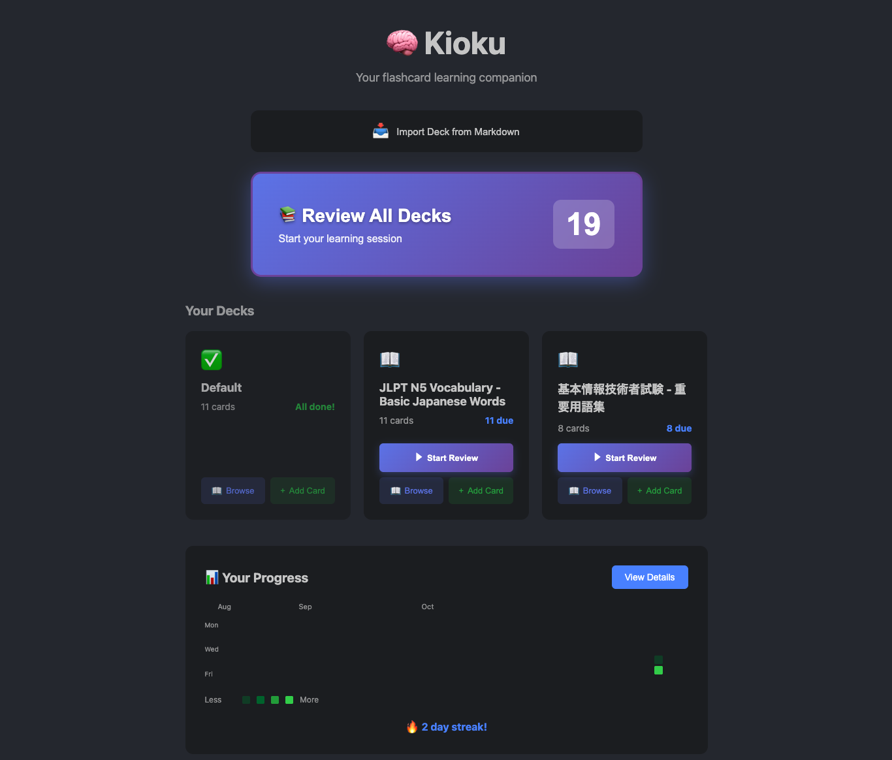
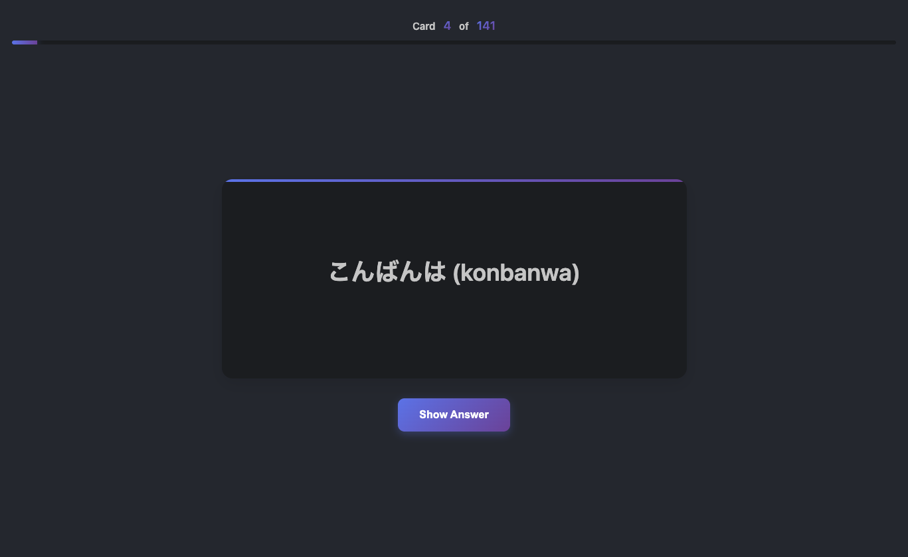

<div align="center">


# Kioku (記憶)

**A powerful flashcard learning extension for VSCode with spaced repetition**

[](https://marketplace.visualstudio.com/items?itemName=Justhiro55.kioku)
[](https://marketplace.visualstudio.com/items?itemName=Justhiro55.kioku)
[](https://github.com/Justhiro55/Kioku/actions/workflows/ci.yml)
[](LICENSE)

[Install from Marketplace](https://marketplace.visualstudio.com/items?itemName=Justhiro55.kioku) | [GitHub](https://github.com/Justhiro55/Kioku) | [Report Issue](https://github.com/Justhiro55/Kioku/issues)

</div>

---

## 🌟 Overview

Kioku (記憶 - "memory" in Japanese) is a flashcard learning extension that integrates spaced repetition directly into VSCode. Learn programming languages, prepare for interviews, study foreign languages—all without leaving your editor.

**Features:**
- 🧠 Spaced Repetition (SM-2 algorithm) for optimal retention
- 📝 Markdown-based card creation (perfect for developers)
- ⌨️ Keyboard-first navigation
- 📊 GitHub-style progress tracking
- 🎯 3 ready-to-use template decks included

## ✨ Features

### 🏠 Home Screen
- GitHub-style contribution calendar showing your learning progress
- Quick access to all your decks with card counts
- One-click deck creation and import

<div align="center">

</div>

### 🎯 Spaced Repetition Learning
- **SM-2 Algorithm**: Automatically schedules reviews based on your performance
- **Keyboard Navigation**: Navigate everything with keyboard shortcuts
- **Undo System**: Press `Cmd+Z` to undo your last rating
- **Progress Tracking**: View statistics after each session

<div align="center">

</div>

### 📚 Deck Management
- **Multiple Decks**: Organize cards by topic, difficulty, or any way you like
- **Quick Browse**: View all cards in a deck at a glance
- **Instant Add**: Add new cards directly from the browse screen
- **Smart Filtering**: See only cards that are due for review

### 📥 Import & Export
- **📝 Markdown Support**: Import decks from markdown files (perfect for developers!)
- **🌐 URL Import**: Share and import decks via GitHub Gist or any markdown URL
- **📋 One-Click Import**: Button on home screen for instant deck creation
- **💾 Multiple Formats**: CSV, JSON, and Markdown export options
- **📦 Templates Included**: TOEIC vocabulary, 基本情報技術者試験, and JLPT N5 Japanese

### 📈 Progress Tracking
- **📅 Contribution Calendar**: GitHub-style heatmap showing daily activity
- **🔥 Streak System**: Track consecutive learning days with visual indicators
- **📊 Detailed Statistics**: Cards reviewed, accuracy rate, and time spent
- **🎯 Performance Insights**: See which decks need more attention

### 🎮 Gamification
- **✨ Animated Completion**: Beautiful celebration screen after each review
- **🏆 Performance Badges**: Get feedback based on your accuracy (Perfect! Excellent! Good Work!)
- **⏱️ Time Tracking**: See how long you've been learning

## 🚀 Installation

### From VS Code Marketplace (Recommended)

1. Open VSCode
2. Press `Cmd+Shift+X` (Mac) or `Ctrl+Shift+X` (Windows/Linux)
3. Search for "**Kioku**"
4. Click **Install**

Or [**install directly from the marketplace →**](https://marketplace.visualstudio.com/items?itemName=Justhiro55.kioku)

### From Source

```bash
git clone https://github.com/Justhiro55/Kioku.git
cd Kioku
npm install
npm run compile
# Press F5 in VSCode to launch
```

## 🚀 Quick Start

1. **Open Kioku**: Click the **🧠** icon in the Activity Bar, then click **Home**
2. **Import a Template**: Click **📥 Import Deck from Markdown** and select:
   - `templates/toeic/golden-word.md` - TOEIC vocabulary (100 words)
   - `templates/kihon-joho/basic-terms.md` - IT terminology (100 terms)
   - `templates/japanese-learning/jlpt-n5-vocabulary.md` - Japanese basics (150 words)
3. **Start Learning**: Click **▶ Start Review** and begin!

**Or create your own deck:**
- Press `Cmd+Shift+P` → `Kioku: Import from Markdown`
- Use AI (ChatGPT/Claude) to generate custom decks in Markdown format
- See [templates/README.md](templates/README.md) for the format

## 💡 Usage

### Creating Cards

#### From Markdown (Recommended for Developers! 🚀)

**Markdown Format:**
Create a `.md` file where H2 headings (##) are card fronts and paragraphs are backs:

```markdown
# JavaScript Basics

## const
A constant variable declaration that cannot be reassigned

## let
Block-scoped variable declaration

## arrow function
Concise function syntax: (x) => x * 2
```

**Import Methods:**

1. **Via Command Palette** (⌘+Shift+P / Ctrl+Shift+P):
   - Type `Kioku: Import from Markdown`
   - Select your `.md` file
   - Cards are automatically created

2. **Via Home Screen**:
   - Click **Home** in the Kioku sidebar
   - Click **📥 Import Deck from Markdown**
   - Select your markdown file
   - Done! Cards appear instantly

3. **From Current File**:
   - Open any `.md` file in the editor
   - Run `Kioku: Create Cards from Current Markdown File`
   - Instant import without file picker

#### Quick Add
1. Browse a deck
2. Click **+ Add Card**
3. Enter front and back
4. Press `Cmd+Enter` to save

### Reviewing Cards

**Keyboard Shortcuts:**
- `Space` / `Enter` - Show answer
- `1` - Again (< 1 min)
- `2` - Hard (< 10 min)
- `3` - Good (1 day)
- `4` - Easy (4 days)
- `Cmd+Z` / `Ctrl+Z` - Undo last rating
- `Cmd+Delete` / `Ctrl+Backspace` - Back to home

**Rating Guide:**
- **Again** 🔄: Completely forgot
- **Hard** 😅: Struggled to recall
- **Good** ✅: Recalled correctly
- **Easy** ⚡: Instant recall

### Managing Decks

**From Home Screen:**
- **📖 Browse**: View all cards in deck
- **+ Add Card**: Quickly add new cards
- **▶ Review**: Start reviewing (only shown if cards are due)

**Keyboard Navigation:**
- `Cmd+Delete` anywhere to return home
- `Cmd+Enter` to save new cards

## 🎨 Templates & Custom Decks

Kioku includes **3 ready-to-use template decks**:

- 🇬🇧 **TOEIC Golden Words** - 100 business vocabulary (600 level)
- 💻 **基本情報技術者試験** - 100 IT terms for FE exam
- 🇯🇵 **JLPT N5 Vocabulary** - 150 basic Japanese words

**Create Custom Decks with AI:**
Use ChatGPT or Claude to generate custom learning decks for any topic:
```
Prompt: "Create a flashcard deck in Markdown for React Hooks.
Use H2 headings (##) for card fronts and paragraphs for backs.
Create 50 cards."
```

**📖 [Full template documentation & examples →](templates/README.md)**

## ⚙️ Settings

Access via `Preferences > Settings > Kioku`

- `kioku.useWebview` - Use modern webview UI for reviews (default: `true`)
- `kioku.reviewAlgorithm` - Choose algorithm: `"sm2"` or `"basic"` (default: `"sm2"`)
- `kioku.storageType` - Storage backend: `"globalState"` or `"sqlite"` (default: `"globalState"`)

## 🎯 Commands

Open Command Palette (`Cmd+Shift+P` / `Ctrl+Shift+P`) and type:

### Learning
- `Kioku: Show Home` - Open home screen
- `Kioku: Start Review` - Begin review session
- `Kioku: Add from Selection` - Create card from selected text

### Organization
- `Kioku: New Deck` - Create a new deck
- `Kioku: Delete Deck` - Delete a deck
- `Kioku: Browse Cards` - View cards in a deck

### Import/Export
- `Kioku: Import from Markdown` - Import deck from file
- `Kioku: Create Cards from Current Markdown File` - Quick import
- `Kioku: Export to Markdown` - Export deck
- `Kioku: Import Deck from URL` - Import from Gist or URL
- `Kioku: Share Deck` - Copy deck to clipboard for sharing

### Analytics
- `Kioku: Show Statistics` - View detailed learning statistics

## 🔬 How It Works

**Spaced Repetition (SM-2 Algorithm):**
Kioku automatically schedules reviews based on your performance:
- Know a card well? See it less frequently
- Struggling with a card? See it more often
- Scientifically proven for optimal long-term retention

**Storage:**
- **GlobalState** (default) - Lightweight, built into VSCode
- **SQLite** - For large decks (switch in settings)

## 🤝 Contributing

Contributions are welcome! Here's how you can help:

1. ⭐ Star the repository
2. 🐛 [Report bugs](https://github.com/Justhiro55/Kioku/issues)
3. 💡 [Suggest features](https://github.com/Justhiro55/Kioku/issues)
4. 🔧 Submit pull requests

## 📄 License

MIT © [Justhiro55](https://github.com/Justhiro55)

## 🙏 Support

If you find Kioku helpful:
- ⭐ [Star the repository](https://github.com/Justhiro55/Kioku)
- 📝 [Write a review](https://marketplace.visualstudio.com/items?itemName=Justhiro55.kioku&ssr=false#review-details)
- 🐦 Share it with your friends!

---

<div align="center">

[Install Now](https://marketplace.visualstudio.com/items?itemName=Justhiro55.kioku) | [Documentation](https://github.com/Justhiro55/Kioku#readme) | [Report Issue](https://github.com/Justhiro55/Kioku/issues)

</div>
